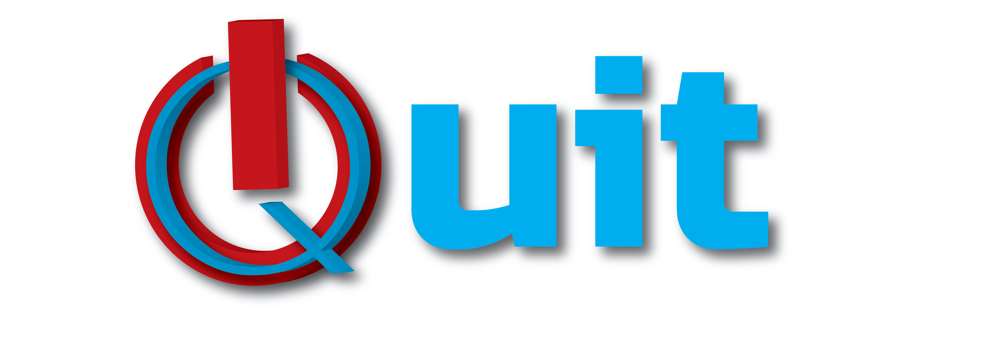

# Quit - The only FOSS Habit Monitor

    
<!----->

Project **Quit** is the first of its kind habit monitoring software designed to understand the user's mobile usage patterns.

It uses various services and functions to obtain and process the device usage patterns. It then labels the user accordingly.

The features of the app include:

* Usage Statistics graph
* Times-Unlocked Graph
* Periodic reminder
* Motivational Notifications
* Recommendations *and much more...*

## Support

Support Me by donation.

  

## License

The application is distributed under the GNU GPL v3 license. You can read about it [here](http://www.gnu.org/licenses/gpl-3.0.en.html)
